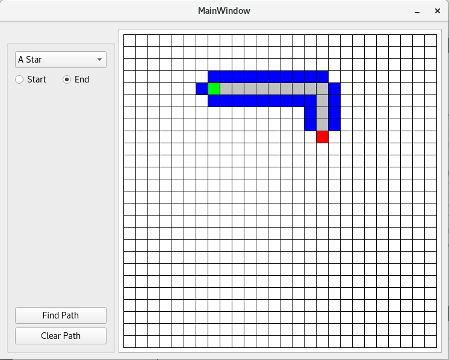

# PathFinding

* [Pavle Kosutic](https://github.com/pavle995) 
* [Slavko Djuricin](https://github.com/djuricin) 
* [Dusan Pilipovic](https://github.com/razzil1) 

## About

Finding path between two nodes using the most popular algorithms for informed and not-informed search.

## Development

* [ ] GUI
    * [x] Grid
    * [x] Node
    * [ ] Instruction box
* [ ] Algorithms
    * [x] DFS
    * [x] BFS
    * [x] Dijkstra
    * [x] A*
    * [ ] etc.
* [x] Implement obstacles

## Screenshot

